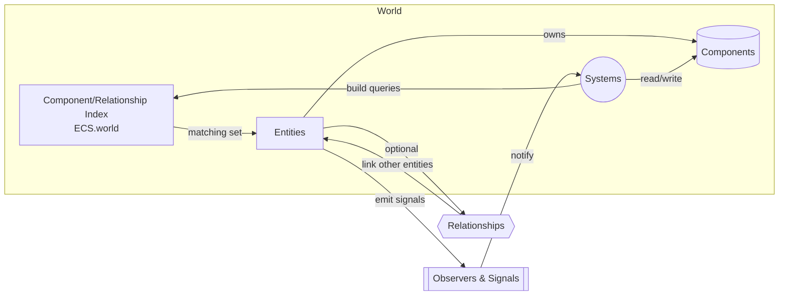

# Entities, Components, and Systems

> **How GECS coordinates data and behavior at runtime**

This document explains how the core GECS building blocks interact in the sample project and the addon itself. Use it as a map when wiring new gameplay features or auditing existing logic.

## Runtime collaboration at a glance

1. Entities spawn into the world with their component set populated from `define_components()` and optional editor-configured resources.
2. Every component registers itself on the entity and notifies the world index so systems can discover it later.
3. Systems declare queries that filter entities by component type, relationship metadata, or arbitrary predicates.
4. Each frame, systems pull the components they asked for, perform their logic, and mutate component data or entity state.
5. Relationships and observers provide cross-entity context and change notifications without direct script references.

- The world (`addons/gecs/world.gd`) maintains the indices that back `ECS.world.query`.
- Systems run inside a `SystemGroup` or via the root `ECS` singleton (`addons/gecs/ecs.gd`) so they can share the same world state and delta time.

## Entities

Entities are lightweight Godot nodes (`addons/gecs/entity.gd`) that act as containers for components and relationships.

**Responsibilities**
- Expose lifecycle hooks (`define_components()`, `on_ready()`, `on_process(delta)`) to configure or synchronize child nodes.
- Add and remove components while keeping the world index in sync via emitted signals like `component_added` and `component_removed`.
- Serve as the attachment point for relationships so other entities and systems can discover contextual links.
- Hold ephemeral state or cached references specific to the scene instance when needed.

Entities should not hard-code gameplay logic. Instead, they feed data into components or connect editor nodes (meshes, animators, etc.) to component references.

## Components

Components extend `addons/gecs/component.gd` and are authored as resources. They describe **what** an entity has, not **how** it behaves.

**Responsibilities**
- Store serializable data (stats, configuration, runtime values).
- Emit `property_changed` when values mutate so observers and systems can react.
- Remain logic-free aside from lightweight helpers or validation; behavioral code belongs in systems.
- Provide resource paths that the entity uses to deduplicate component instances and register them with the world index for fast queries.

Components can be composed freely. For example, a robot thruster entity may combine `C_ModuleAttachment`, `C_MoveCapability`, and `C_PowerConsumer` to describe where it mounts, how it moves, and what it costs to run.

## Systems

Systems (`addons/gecs/system.gd`) encode all runtime behavior. They are regular Godot nodes that the world ticks every frame.

**Responsibilities**
- Declare queries through the fluent `QueryBuilder` API (`addons/gecs/query_builder.gd`) to pull matching entities and components.
- Optionally subscribe to observers or signals when reacting to structural changes is cheaper than polling.
- Mutate component data, call back into entities for orchestration, or emit custom signals for higher-level code (UI, audio, etc.).
- Respect Godot's process/physics ticks by setting `process_mode` or running inside an appropriate `SystemGroup` when batching related systems.

Keep system scope narrow—each class should focus on one gameplay concern (movement, health regeneration, script integration) so swaps or refactors do not cascade across features.

## Relationships and observers

- **Relationships** (`addons/gecs/relationship.gd`) provide directional links between entities (e.g., frame ↔ module). Systems traverse them to aggregate data or coordinate multi-entity behaviors.
- **Observers** (`addons/gecs/observer.gd`) watch component or relationship events, acting like lightweight event systems that fan out notifications to interested systems without tight coupling.

Use these tools to exchange context between entities while preserving ECS decoupling: the owning entity does not need to know who might consume its data.

## Putting it together in gameplay code

When you add a new feature:
- Model the data requirements as reusable components and attach them in the relevant entity scenes or via `define_components()`.
- Introduce systems that query for those components, iterate over the matches, and update data in response to `delta`, input, AI scripts, or relationship state.
- Extend relationships or observers only when multiple entities must coordinate or when reactive updates beat full queries.

Following this pattern keeps modules interchangeable, allows designers to compose behavior visually, and ensures systems stay focused on a single responsibility.
