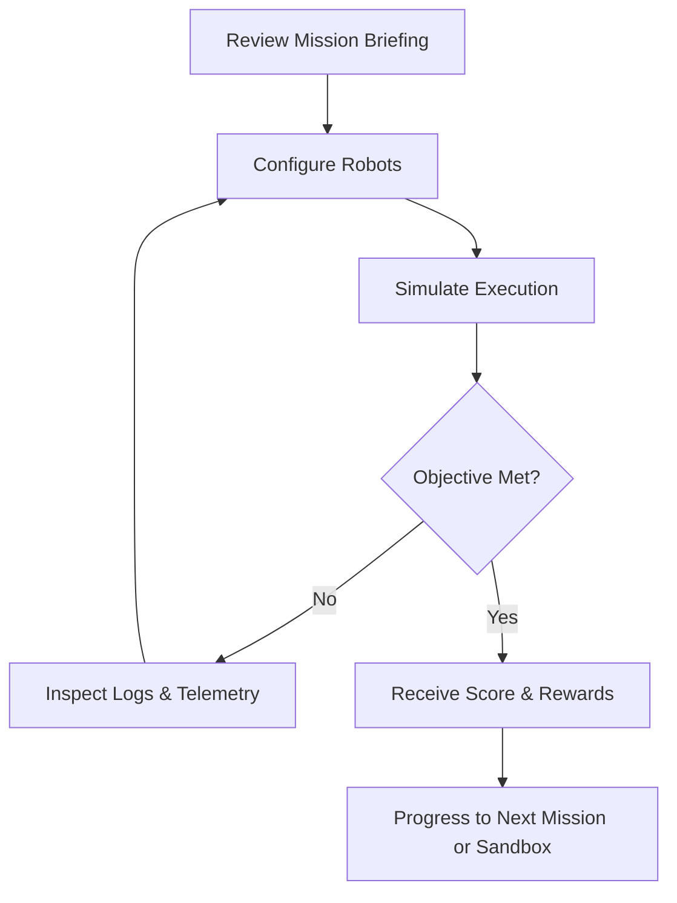

# Gameplay Overview

## Core Fantasy
Players act as mission commanders configuring autonomous service robots to accomplish complex tasks in a hazardous industrial colony. The thrill stems from designing efficient strategies, watching them unfold, and iterating on solutions.

## Player Journey
1. **Orientation** – Tutorial missions introduce controls, robot abilities, and scripting basics with guided prompts.
2. **Experimentation** – Early campaign levels encourage trial-and-error in safe environments to learn system interactions.
3. **Mastery** – Later missions demand optimized strategies, multi-robot coordination, and resource management.
4. **Expression** – Sandbox mode unlocks to let players remix rules and design custom challenges. [ASSUMPTION]

## Game Loop

## Core Mechanics
- **Mission Briefings** provide narrative context, objectives, and constraints such as time limits or resource caps.
- **Robot Configuration** allows players to assign roles, equip modules, and author scripts via block or text editors.
- **Simulation Phase** runs deterministically, displaying actions, errors, and performance metrics.
- **Debriefing** summarises outcomes, highlights inefficiencies, and awards medals.

## Controls & Interaction Model
- **Navigation**: WASD/Arrow keys for camera panning; right mouse drag to rotate. [ASSUMPTION]
- **Selection**: Left click to select robots or map tiles; shift-click for multi-selection.
- **Scripting**:
  - Block Editor: Drag blocks from palette, snap into loops/conditionals.
  - Text Editor: Type commands with auto-complete and inline linting.
- **Simulation Controls**: Play/Pause, Step Forward, Speed Slider (0.5x–4x). [ASSUMPTION]

## Progression Structure
- Campaign structured into thematic chapters introducing new mechanics sequentially.
- Completion of missions grants tech upgrades unlocking additional robot modules. [ASSUMPTION]
- Scoring tiers determine medal awards, unlocking optional challenge missions. [ASSUMPTION]

## Difficulty & Accessibility
- Adaptive hint system surfaces recommendations after repeated failures. [ASSUMPTION]
- Optional "Assist Mode" reduces penalty timers and highlights critical objects. [ASSUMPTION]
- Colorblind-safe palettes, text scaling, and audio captioning integrated into settings.

## Narrative Beats
- Story follows restoration of a damaged colony using autonomous robots.
- Mission briefings delivered by AI dispatcher character providing guidance and humor. [ASSUMPTION]
- Each chapter culminates in a set-piece mission showcasing combined mechanics.

## Replay & Sandbox Features
- Level replay viewer allows players to scrub through simulation timeline and annotate actions. [ASSUMPTION]
- Sandbox provides adjustable rule sets (resource limits, enemy behaviors) with shareable configuration files. [ASSUMPTION]
- Global leaderboards for challenge missions are deferred to post-launch. [ASSUMPTION]

## Player Experience Goals
- Encourage creative problem solving through flexible scripting systems.
- Provide clear feedback loops that teach players how to improve strategies.
- Maintain tension and satisfaction via escalating mission stakes and meaningful rewards.
