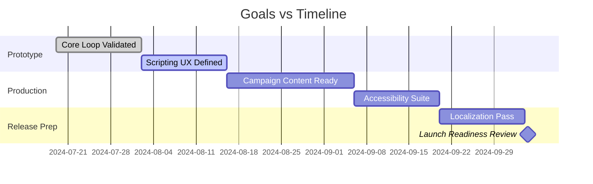

# Project Goals

## Strategic Objectives
1. **Demonstrate Toolkit Strengths** – Showcase the scripting and automation capabilities provided by `sc-godot` through polished gameplay scenarios.
2. **Deliver Engaging Gameplay** – Craft a tactical puzzle experience with meaningful decision-making, replayability, and clear mastery paths.
3. **Enable Community Adoption** – Produce documentation and mod-friendly architecture that encourages external contributors.
4. **Maintain Production Quality** – Ship with minimal bugs, performant builds, and accessible UX standards.

## Success Metrics
- 90% of campaign levels completed by playtesters without direct developer guidance. [ASSUMPTION]
- Average of 4.2/5 or higher satisfaction rating from usability sessions. [ASSUMPTION]
- Maintain 60 FPS on mid-tier hardware for desktop and 30 FPS on web builds.
- Achieve 95% automated test coverage on core gameplay systems. [ASSUMPTION]
- Publish at least three technical blog posts summarizing lessons learned.

## Non-Goals
- Implementing full multiplayer or synchronous co-op features.
- Supporting console platforms in the first release. [ASSUMPTION]
- Providing a full-fledged level editor for public sharing.

## Deliverables
- Fully playable campaign with narrative framing and tutorials.
- Modular scripting UI components with both block and text editing capabilities.
- Comprehensive documentation covering player guide, technical architecture, and modding entry points.
- Automated CI/CD pipeline targeting desktop and web builds with regression test suite.

## Key Results Timeline

## Epics, Stories, and Tasks
### Epic: Tutorial & Onboarding
- **Story: Build interactive tutorial level 0**
  - Task: Design guided script prompts.
  - Task: Implement tutorial UI overlays.
  - Task: Capture telemetry for stumbling points. [ASSUMPTION]
- **Story: Contextual help system**
  - Task: Create tooltip library referencing glossary.
  - Task: Integrate inline video/gif references using lightweight format. [ASSUMPTION]

### Epic: Campaign Content
- **Story: Draft narrative arc**
  - Task: Outline mission briefings and debriefings.
  - Task: Record placeholder VO or text-to-speech assets. [ASSUMPTION]
- **Story: Build Levels 1-5**
  - Task: Greybox layouts with objectives.
  - Task: Script enemy/ally behaviors.
  - Task: Playtest and iterate.
- **Story: Build Levels 6-10** [ASSUMPTION]
  - Task: Introduce advanced mechanics (fog, resource scarcity). [ASSUMPTION]
  - Task: Implement scoring variants.

### Epic: Scripting Interface
- **Story: Block-based editor**
  - Task: Define block palette & grammar.
  - Task: Implement drag-and-drop interactions.
  - Task: Map blocks to runtime script instructions.
- **Story: Text editor with validation**
  - Task: Provide syntax highlighting and autocomplete.
  - Task: Create static analysis rules for safety.
  - Task: Link errors back to in-world robot feedback.

### Epic: Systems & Progression
- **Story: Scoring and medals**
  - Task: Define thresholds for Gold/Silver/Bronze per level.
  - Task: Implement scoring calculation pipeline.
  - Task: Display medals in mission select.
- **Story: Unlock flow**
  - Task: Track campaign progression state.
  - Task: Gate advanced levels and sandbox mode. [ASSUMPTION]

### Epic: Accessibility & UX
- **Story: Colorblind modes**
  - Task: Define palette presets with WCAG compliance.
  - Task: Implement toggle and preview screen.
- **Story: Input customization**
  - Task: Remapping UI for keyboard/mouse/gamepad. [ASSUMPTION]
  - Task: Save/load input profiles.

### Epic: Platform & Tooling
- **Story: Automated builds**
  - Task: Configure CI pipeline.
  - Task: Set up automated testing across target platforms.
- **Story: Telemetry & Analytics**
  - Task: Instrument critical events respecting privacy. [ASSUMPTION]
  - Task: Build dashboards for sprint reviews.

## Open Questions
- Final art direction and asset pipeline confirmation. [ASSUMPTION]
- Localization scope and target languages. [ASSUMPTION]
- Monetization/Distribution strategy beyond open-source release. [ASSUMPTION]
