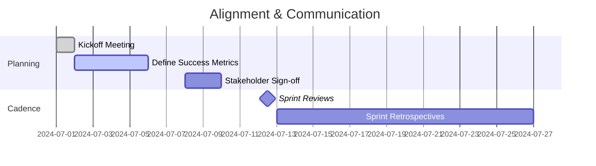

# Project Overview

## Vision
Create a polished, replayable Godot-based game that demonstrates the capabilities of the `sc-godot` toolkit while providing an engaging experience that can be expanded upon in future iterations.

## Context
- Repository: `sc-godot`
- Engine: Godot 4.x
- Target Platforms: Desktop (Windows, macOS, Linux) and Web (HTML5) builds. [ASSUMPTION]
- Project Type: Narrative-driven tactical puzzle experience blending scripting-driven agents with player authored logic. [ASSUMPTION]

## Target Audience
- Intermediate players who enjoy thoughtful strategy and automation puzzles.
- Developers and designers evaluating the `sc-godot` scripting integrations.

## Scope Summary
- Core loop centers on configuring autonomous robots to complete level objectives under resource constraints.
- Campaign of handcrafted scenarios introducing mechanics progressively.
- Sandbox mode that unlocks once players complete the campaign finale. [ASSUMPTION]
- In-game editor for sharing scenarios is explicitly out-of-scope for the initial release.

## High-Level Features
1. **Interactive Tutorials** guiding players through controls, scripting, and objectives.
2. **Scenario Campaign** consisting of 8-10 levels with escalating complexity. [ASSUMPTION]
3. **Robot Programming Interface** allowing block-based and textual scripting.
4. **Scoring & Progression** with medals/badges tied to efficiency metrics.
5. **Accessibility Options** for colorblind-safe palette, adjustable text size, and simplified controls.

## Stakeholders
- Product Owner: Internal tools team.
- Design Lead: TBD. [ASSUMPTION]
- Engineering Lead: TBD. [ASSUMPTION]
- QA Lead: Shared QA pool. [ASSUMPTION]

## Dependencies
- Godot 4.x stable release cycle.
- Availability of scriptable agents within `robot` module.
- Localization tooling for multi-language support. [ASSUMPTION]

## Constraints
- Must be fully open-source with permissive licensing.
- Must support deterministic simulation for replay sharing.
- Development window: 12 weeks from project kickoff. [ASSUMPTION]

## Risks & Mitigations
| Risk | Impact | Mitigation |
| --- | --- | --- |
| Ambiguous feature scope | Medium | Maintain weekly backlog refinement sessions. |
| Performance issues on Web builds | High | Establish profiling benchmarks early and optimize shaders/scripts. |
| Complexity of dual scripting modes | High | Design unified abstraction layer and shared tutorials. |
| Limited art resources | Medium | Use modular, reusable art assets and stylized UI. [ASSUMPTION] |

## Stakeholder Alignment Timeline

## Milestones & Deliverables
1. **Milestone A (Week 2)** – Baseline project setup, CI configured, design drafts validated.
2. **Milestone B (Week 5)** – Core gameplay prototype with two playable levels and tutorial.
3. **Milestone C (Week 8)** – Full campaign content complete, progression systems integrated.
4. **Milestone D (Week 10)** – Polish pass, accessibility features, performance tuning.
5. **Release Candidate (Week 12)** – Final QA sign-off, marketing assets delivered. [ASSUMPTION]

## Backlog Structure
- **Epics** map to major features (Tutorial, Campaign, Scripting, UI/UX, Platform Support).
- **Stories** break down player-facing value increments.
- **Tasks** capture implementation steps, documentation, testing, and tooling needs.

## Next Steps
- Validate assumptions with stakeholders during kickoff.
- Refine backlog estimates and align with velocity projections.
- Establish cross-discipline collaboration rituals.
